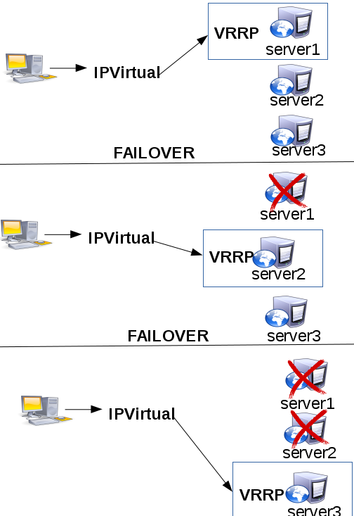

Failover con Keepalived (Muy utilizado, unicamente como failover)
=================================================================

Vamos a simular un sistema disponible el 99,99…% del tiempo con Keepalived, de la forma más básica y simple.

Para esto se suele configurar lo que se denomina un "sistema redundante", es decir dos o más sistemas configurados de forma que uno de ellos sea el que está en funcionamiento y en el caso en que deje de funcionar por cualquier motivo, se active otro de los sistemas que hasta ese momento estaba "en espera" o "inactivo" tan rápidamente como sea posible. Mediante este sistema, incluso en el peor de los casos (la rotura de un disco duro, un desbordamiento de memoria que mate un proceso vital, o incluso que alguien le pegue una patada al cable) puede seguir funcionando gracias al siguiente equipo hasta entonces "dormido".

Para conocer más configuraciones:
- `Keepalived UserGuide <http://www.keepalived.org/pdf/UserGuide.pdf/>`_
- `Keepalived LVS-NAT-Keepalived-HOWTO <http://www.keepalived.org/LVS-NAT-Keepalived-HOWTO.html>`_

Como estará configurado el laboratorio
+++++++++++++++++++++++++++++++++++++++

- 192.168.1.20 -- IPV - IP virtual.
- 192.168.1.21 -- Ubuntu 14.04.4, server1 -- Keepalived
- 192.168.1.22 -- Ubuntu 14.04.4, server2 -- Keepalived
- 192.168.1.23 -- Ubuntu 14.04.4, server3 -- Keepalived

Configuración de los servidores con keepalived
++++++++++++++++++++++++++++++++++++++++++++++

En todos los servidores vamos a instalar estos paquetes.::
	
	# apt-get update && apt-get install keepalived -y

Configuremos la interfaz de red en cada uno de los servidores con su IP correspondiente, para server1->192.168.1.21, para server2->192.168.1.22 y para server3->192.168.1.23 (Importante que este como adaptador puente)::

	# vi /etc/network/interfaces
	# The loopback network interface
	auto lo
	iface lo inet loopback

	# The primary network interface
	auto eth0
	iface eth0 inet static
	address 192.168.1.21
	netmask 255.255.255.0
	gateway 192.168.1.1
	dns-nameserver 192.168.1.1

En server1, vamos a configurar Keepalived, creamos el archivo de configuración keepalived.conf::

	# vi /etc/keepalived/keepalived.conf

	vrrp_instance MY-FAILOVER {
		state MASTER
		interface eth0
		virtual_router_id 21
		priority 150
		advert_int 1
		authentication {
		    auth_type PASS
		    auth_pass Venezuela21
		}
		virtual_ipaddress {
		    192.168.1.20
		}
	}

Creamos el keepalived.conf en server2::

	# vi /etc/keepalived/keepalived.conf

	vrrp_instance MY-FAILOVER {
		state MASTER
		interface eth0
		virtual_router_id 21
		priority 120
		advert_int 1
		authentication {
		    auth_type PASS
		    auth_pass Venezuela21
		}
		virtual_ipaddress {
		    192.168.1.20
		}
	}

Ahora en server3 creamos el keepalived.conf::

	# vi /etc/keepalived/keepalived.conf

	vrrp_instance MY-FAILOVER {
		state MASTER
		interface eth0
		virtual_router_id 21
		priority 100
		advert_int 1
		authentication {
		    auth_type PASS
		    auth_pass Venezuela21
		}
		virtual_ipaddress {
		    192.168.1.20
		}
	}

El archivo de configuración "/etc/keepalived/keepalived.conf" es igual en todos los servidores excepto por la linea priority, especifica la prioridad de la instancia en el router, es decir, cual de los servidores tendrá la carga de trabajo cada vez que exista un failover.

En todos los servidores iniciamos el servicio de keepalived.::

	# /etc/init.d/keepalived start
	
		* Starting keepalived                       [ OK ]

Ya esta listo ahora, solo resta hacer pruebas.

Realizar pruebas de failover
++++++++++++++++++++++++++++

Lo primero es siempre consultar el log en cada servidor, por lo que recomiendo montar un ``tail -f /var/log/syslog`` en cada servidor y luego detener el servicio  ``/etc/init.d/keepalived stop`` para luego iniciarlo el servicio nuevamente  ``/etc/init.d/keepalived start`` e ir viendo lo que se registra en los logs de cada servidor

En cada uno de los servidores y de forma aleatoria ejecute::

	# /etc/init.d/keepalived stop && sleep 5 && /etc/init.d/keepalived start

Vea la salida en el syslog y vaya analizando::

	# tail -22 /var/log/syslog

Desde su HOST también puede ir haciendo ping para registrar la arp y ver como la IPV va cambiando entre las mac address de los servidores.

Con todos los servidores arriba y también con el keepalived. en su HOST ejecute::

	# for i in {1..3} ; do ping -c 1 192.168.1.2$i ; done
		PING 192.168.1.21 (192.168.1.21) 56(84) bytes of data.
		64 bytes from 192.168.1.21: icmp_seq=1 ttl=64 time=0.331 ms

		--- 192.168.1.21 ping statistics ---
		1 packets transmitted, 1 received, 0% packet loss, time 0ms
		rtt min/avg/max/mdev = 0.331/0.331/0.331/0.000 ms
		PING 192.168.1.22 (192.168.1.22) 56(84) bytes of data.
		64 bytes from 192.168.1.22: icmp_seq=1 ttl=64 time=0.293 ms

		--- 192.168.1.22 ping statistics ---
		1 packets transmitted, 1 received, 0% packet loss, time 0ms
		rtt min/avg/max/mdev = 0.293/0.293/0.293/0.000 ms
		PING 192.168.1.23 (192.168.1.23) 56(84) bytes of data.
		64 bytes from 192.168.1.23: icmp_seq=1 ttl=64 time=0.306 ms

		--- 192.168.1.23 ping statistics ---
		1 packets transmitted, 1 received, 0% packet loss, time 0ms
		rtt min/avg/max/mdev = 0.306/0.306/0.306/0.000 ms

	# arp 
		Address                  HWtype  HWaddress           Flags Mask            Iface
		192.168.1.22             ether   08:00:27:0d:0f:c0   C                     wlan0
		192.168.1.23             ether   08:00:27:ca:84:b2   C                     wlan0
		192.168.1.1              ether   38:d8:2f:03:9e:d4   C                     wlan0
		192.168.1.20             ether   08:00:27:63:ed:f3   C                     wlan0
		192.168.1.21             ether   08:00:27:63:ed:f3   C                     wlan0

Ahora que ya tenemos los registro de arp vamos a ir haciendo las pruebas, no deje de ir viendo los logs, primero detenemos el servicio de keepalived en server1 y hacemos ping a la IPV 192.168.20 y seguidamente el arp.::

	# ping  -c 1 192.168.1.20 | grep from
		64 bytes from 192.168.1.20: icmp_seq=1 ttl=64 time=0.284 ms

	# arp 
		Address                  HWtype  HWaddress           Flags Mask            Iface
		192.168.1.22             ether   08:00:27:0d:0f:c0   C                     wlan0
		192.168.1.23             ether   08:00:27:ca:84:b2   C                     wlan0
		192.168.1.1              ether   38:d8:2f:03:9e:d4   C                     wlan0
		192.168.1.20             ether   08:00:27:0d:0f:c0   C                     wlan0
		192.168.1.21             ether   08:00:27:63:ed:f3   C                     wlan0

Detenemos el servicio de keepalived en server2 y hacemos ping a la IPV 192.168.20 y seguidamente el arp.::

	# ping  -c 1 192.168.1.20 | grep from
		64 bytes from 192.168.1.20: icmp_seq=1 ttl=64 time=0.284 ms

	# arp 
		Address                  HWtype  HWaddress           Flags Mask            Iface
		192.168.1.22             ether   08:00:27:0d:0f:c0   C                     wlan0
		192.168.1.23             ether   08:00:27:ca:84:b2   C                     wlan0
		192.168.1.1              ether   38:d8:2f:03:9e:d4   C                     wlan0
		192.168.1.20             ether   08:00:27:ca:84:b2   C                     wlan0
		192.168.1.21             ether   08:00:27:63:ed:f3   C                     wlan0

Vemos como la IPV va cambiando su mac address lo que evidencia que si se esta haciendo el failover. Inicie keepalived en todos los servidores y vea como la prioridad es tal como se configuro en "/etc/keepalived/keepalived.conf" 

También puede colocar el ``tcpdump`` en server1, server2 y server3::

	# tcpdump -i eth0 host 192.168.1.20 -vvv

Luego desde el HOST hacer ``ping`` y ver los resultados en el ``tcpdump``.::

	# for i in {1..3} ; do ping -c 1 192.168.1.2$i ; done

Listo...!!! ya tenemos un failover muy basico pero funcional.

Agregar servicios para hacer failover
+++++++++++++++++++++++++++++++++++++

Anteriormente solo configuramos keepalived para que hiciera failover si encontraba una falla en el adaptador de red o en el servicio de keepalived. Ahora vamos agregar en la configuración de keepalived chequeo de servicios como (ssh, apache, haproxy, etc), también vamos agregar chequeo de puertos y con lo antes dicho podemos armar un failover dependiendo de un servio o de un puerto. Para eso vamos a utilizar estos parámetros en el archivo de configuración.
- Check Script 
- Notify Script

**Check Script**, hace una verificación de un script. Este script debe retornar (0) para identificar que todo está bien, si el script retorna (1) o cualquier valor distinto de (0) algo salió mal. Este valor es utilizado por Keepalived para tomar medidas. La estructura seria así::

	vrrp_script chequea_script {
	  script       "/usr/local/bin/my-script.sh"
	  interval 2   # Cada 2 segundos chequea
	  fall 2       # require 2 fallas para hacer el failover
	  rise 2       # Con 2 valores exitosos se pone como operativo
	}

El script ``my-script.sh`` puede tener la función para alguna de estas ideas:
- Para identificar si un servicio esta corriendo.
- Alguna interfaz remota esta arriba.
- Algún servicio remoto esta arriba
- Responde a ping alguna IP, ejemplo  8.8.8.8
- No hay espacio en disco.
- etc...etc.

Para que el vrrp_instance interprete que estamos haciendo este chequeo de script se debe introducir el track_script. Cuando track_script devuelve otro código de 0 dos veces, la instancia de VRRP cambiará el estado a FALLO.::

	vrrp_instance MY-FAILOVER {
		state MASTER
		interface eth0
		virtual_router_id 21
		priority 120
		advert_int 1
		authentication {
		    auth_type PASS
		    auth_pass Venezuela21
		}
		virtual_ipaddress {
		    192.168.1.20
		}
		track_script {
			chequea_script
		}
	}

Es muy común utilizar ``killall -0 servicio`` para retornar si un servicio esta corriendo, vea estos ejemplos::

	vrrp_script chequea_haproxy {
	  script       "killall -0 haproxy"
	  interval 2 
	  fall 2
	  rise 2 
	}

	vrrp_script chequea_http {
	  script       "killall -0 apache2"
	  interval 2 
	  fall 2
	  rise 2 
	}

	vrrp_script chequea_smtp {
	  script       "killall -0 sendmail"
	  interval 2 
	  fall 2
	  rise 2 
	}

También con vrrp_script podemos hacer chequeo de los puertos de esta forma::

	vrrp_script chequea_http_port/80 {
	  script "</dev/tcp/127.0.0.1/443"
	  interval 2 
	  fall 2
	  rise 2 
	}

	vrrp_script chequea_https_port {
	  script "</dev/tcp/127.0.0.1/443"
	  interval 2 
	  fall 2
	  rise 2 
	}

	vrrp_script chequea_smtp_port {
	  script "</dev/tcp/127.0.0.1/25"
	  interval 2 
	  fall 2
	  rise 2 
	}

**Notify Script**, Un script de notificar se puede utilizar para realizar otras acciones dependiendo del estado de VRRP, se debe colocar al final del bloque de la instancia.::

	vrrp_instance MY-FAILOVER {
	 [...]
	 notify /usr/local/bin/my-notify.sh
	}

El script es llamado después de cualquier cambio de estado en el VRRP, estos son los parámetros::

- $1 = "GROUPO" o "INSTANCIA"
- $2 = nombre del grupo o de la instancia.
- $3 = estados ("MASTER", "BACKUP", "FAULT")

Un ejemplo del script "my-notify.sh"::

	#!/bin/bash

	TYPE=$1
	NAME=$2
	STATE=$3

	case $STATE in
		    "MASTER") /usr/bin/logger "Entro en MASTER"
		              exit 0
		              ;;
		    "BACKUP") /usr/bin/logger "Entro en BACKUP"
		              exit 0
		              ;;
		    "FAULT")  /usr/bin/logger "Entro en FAULT"
		              exit 0
		              ;;
		    *)        /usr/bin/logger "Estado no identificado"
		              exit 1
		              ;;
	esac

No olvide darle el permiso de ejecución::

# chmod +x /usr/local/bin/my-notify.sh

Con **Notify Script**, podemos lograr o administrar un comportamiento que nosotros necesitemos al momento que la VRRP cambie de estado.

Si usted quiere el servidor puede entrar en estado FAULT o hacer failover, si uno o más interfaz de red estan abajo. Para eso se utiliza track_interface, ejemplo::

  track_interface {
    eth0
    eth1
  }

Dejamos aqui un ejemplo del archivo de configuración ``/etc/keepalived/keepalived.conf`` con todo lo antes dicho, recuerde cambiar la prioridad dependiendo del servidor. En cada uno de los servidores se le instalo ``apache2`` y se creo un script HTML en donde tenga el nombre de cada servidor para identificar por medio del navegado cual servidor responde::

	# apt-get install apache2 -y

	# vi /var/www/html/test.html
		<html>
		<body>
		<h3>Servidor SERVER1</h3>
		</body>
		</html>

	# vi /etc/keepalived/keepalived.conf
	vrrp_script chequea_script {
	  script       "killall -0 apache2"
	  interval 2   # Cada 2 segundos chequea
	  fall 2       # require 2 fallas para hacer el failover
	  rise 2       # Con 2 valores exitosos se pone como operativo
	}

	vrrp_instance MY-FAILOVER {
		state MASTER
		interface eth0
		virtual_router_id 21
		priority 150
		advert_int 1
		authentication {
		    auth_type PASS
		    auth_pass Venezuela21
		}
		virtual_ipaddress {
		    192.168.1.20
		}
		track_script {
			chequea_script
		}	
		track_interface {
		  eth1
		}
		notify /usr/local/bin/my-notify.sh
	}

Ya saben como hacer las pruebas. el script my-notify.sh escribe en syslog.

Bueno, felicitaciones ...!!!

Más información, consulte `Keepalived <http://www.keepalived.org/>`_, la documentación /usr/share/doc/keepalived/ y el man de  keepalived (8) y keepalived.conf (5).

Para mas configuraciones:
- `Keepalived UserGuide <http://www.keepalived.org/pdf/UserGuide.pdf/>`_
- `Keepalived LVS-NAT-Keepalived-HOWTO <http://www.keepalived.org/LVS-NAT-Keepalived-HOWTO.html>`_
